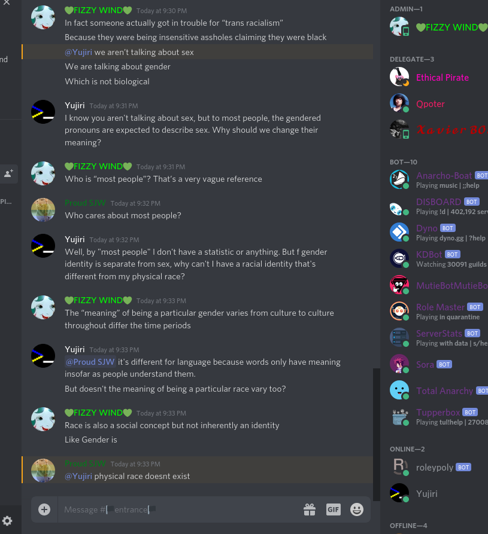
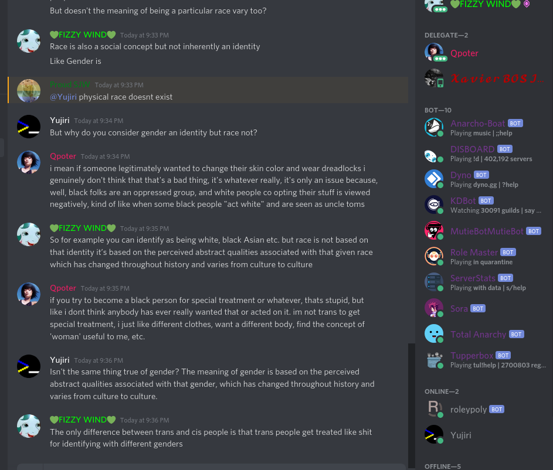
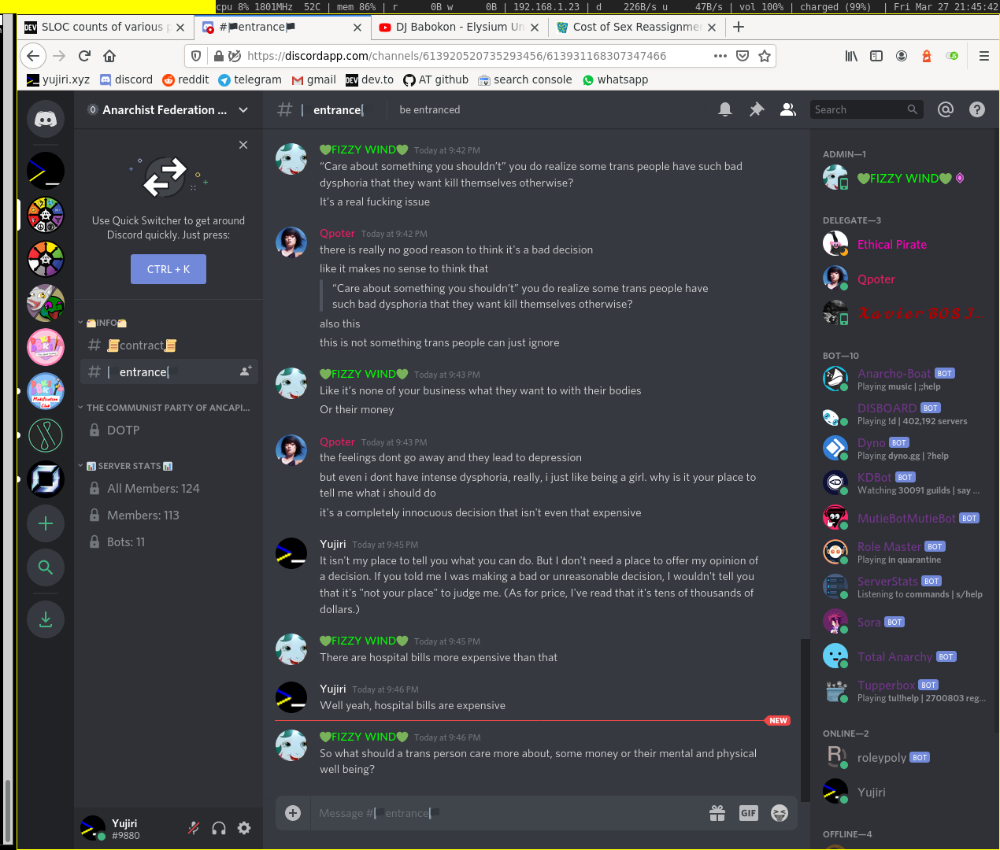
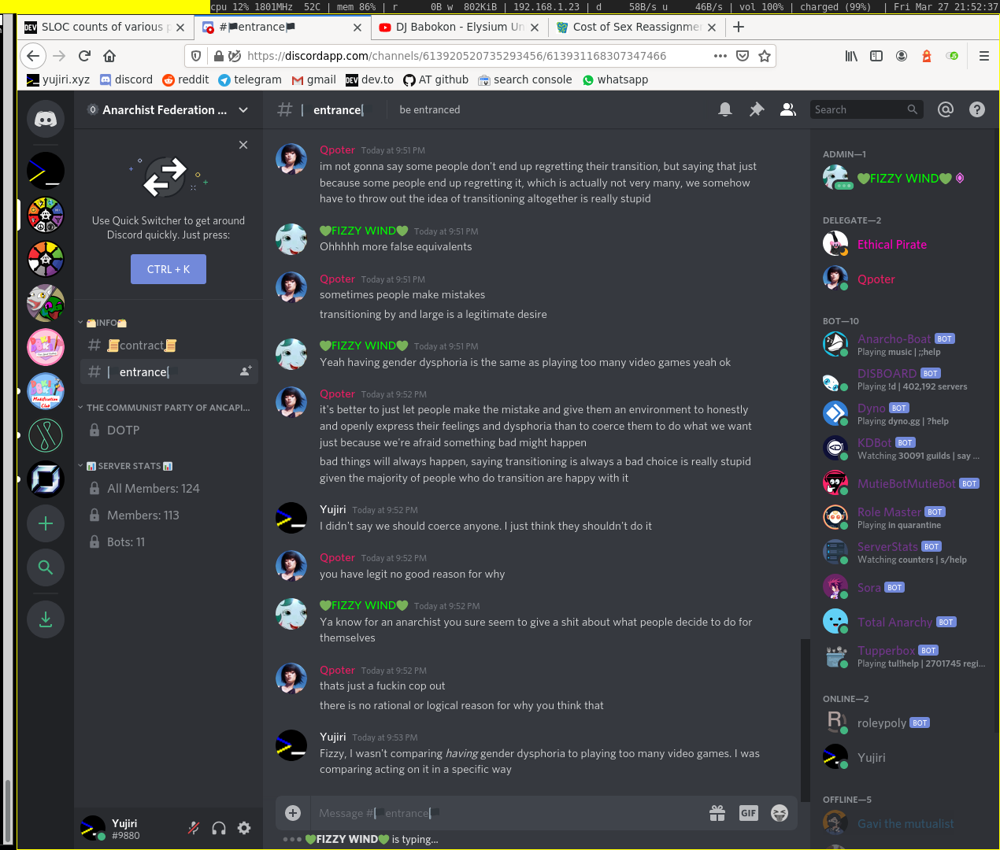
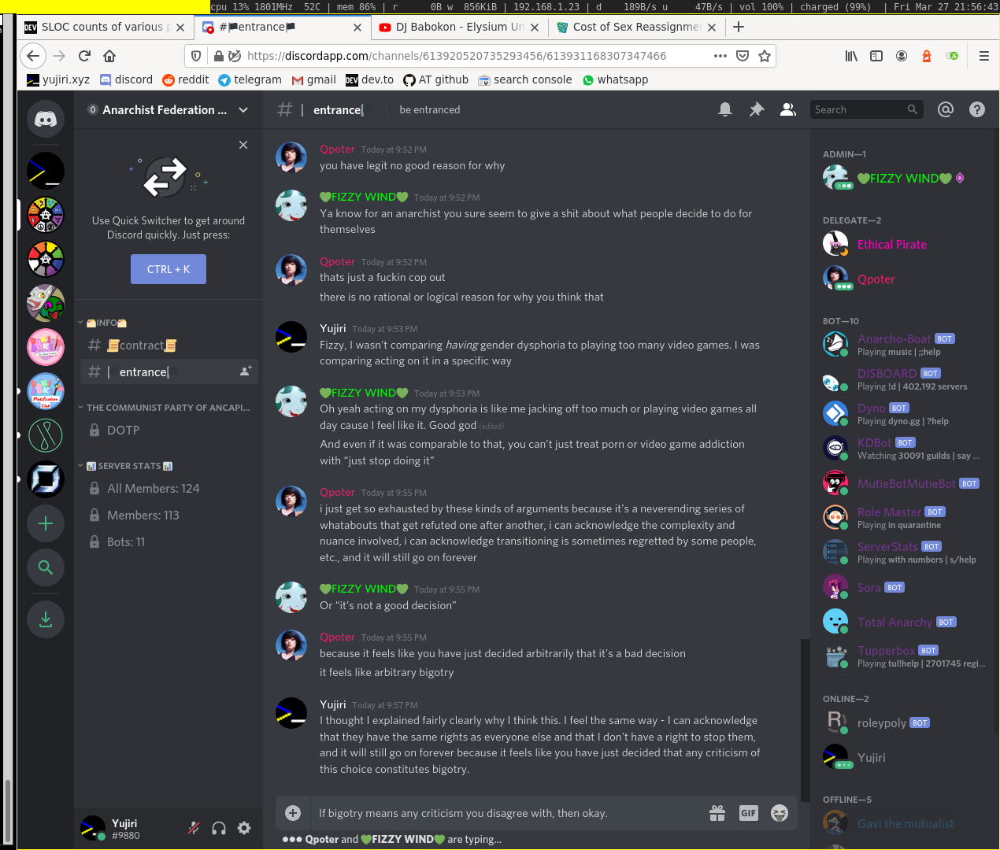
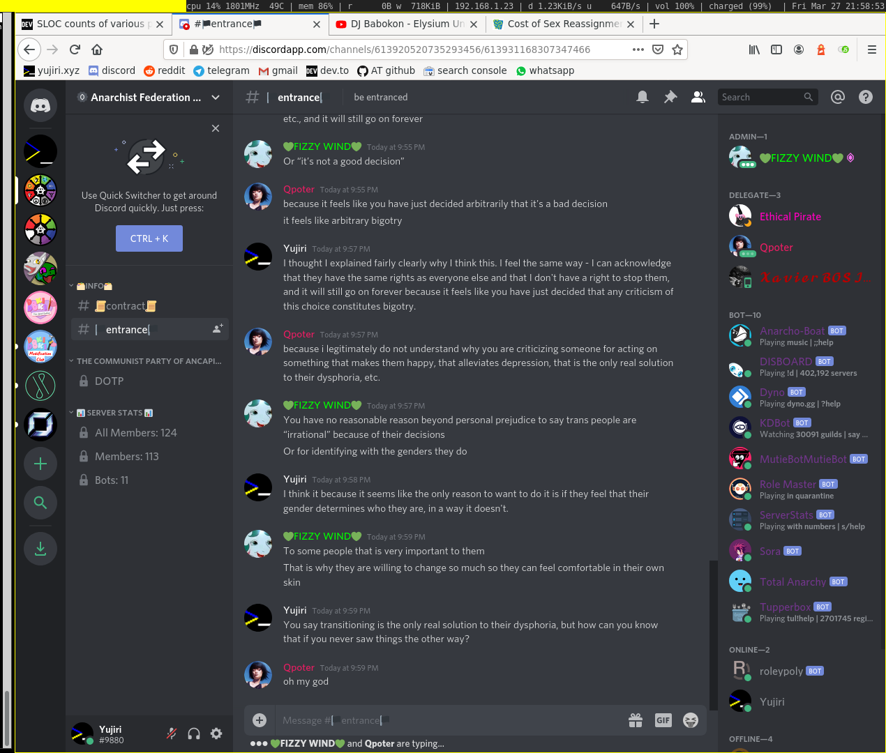
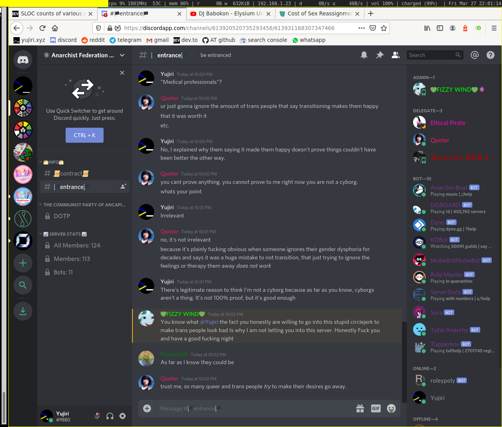

TITLE Transgenderism in Fizzy's server
NAV Transgenderism in Fizzy's server
TEMPLATE DEFAULT
DESC An experience I had reinforcing my negative perception of trannies as sexist assholes who can't take disagreement.

I've [explained](/protagonism/gender) why I disapprove of transgenderism, but my case isn't completely airtight - as main_gi once pointed out to me, it's possible from my perspective that most trans people have a legitimate genetic issue that causes their "discomfort" rather than them having sexist attitudes.

Well today, I followed an invite to Fizzy the Mutualist's Discord server. I thought it was a great opportunity to learn about mutualism, an anarchist ideology I knew very little about. Who knew, maybe mutualism has the next insight I need.

After joining the server, I saw the rules, which included the usual leftist "don't disagree with us about anything related to gender" clauses, as vague as ever (words like 'harass', 'prejudice', 'anti-' used). I reluctantly agreed planning not to start a discussion about it. So the gatekeeper, Fizzy's right-hand Qpoter, came to ask me one question first: "What do you think of trans peeps".

I was thoroughly discouraged. Hadn't I just agreed to the TOS? And why that question in particular? If she'd asked me about gays or bisexuals, I could have honestly answered that I don't have a problem with them at all. Why did it have to be trans peeps? Did these people know who I was or something?

I idled and deliberated for a long time on how to word my next message. I wasn't going to be dishonest, but I had to be really careful. It would decide whether I was allowed to learn from a mutualist.

Before long, she told me "ANSWER IN 5 SECONDS OR YOU'RE BOOTED". I wasn't nearly done!

I scrambled to type it out to a state where I could press enter. I posted at about 5.5 seconds. I followed with the second message a few seconds later. Then I sat back and anticipated the ban.

She didn't ban me immediately, but said something like "I said I would boot you as a joke. I don't have a problem with discussing it but if ur not willing to respect other people then ur not welcome here".

This struck me as doublespeak. Was I allowed to stay or not? Well, I took it as an invitation to make my case at greater length. I started with the heaviest concession I could honestly give, emphasizing that trans people have all the same rights as me and that I didn't have a right to stop them.

I think those words earned me the chance to talk - or, as I would see later, a longer timeout before I had to concede altogether or leave. She took on a bored tone and told me she'd never heard any real reason why transgenderism was irrational or whatnot.

I started to get hopeful. That could very well be true! Maybe the only people she'd heard criticism of leftist gender ideology from were conservatives. Maybe I had the chance to really make an impact here!

(By the way, I'm calling Qpoter 'she' because it sounds like she did transition, which makes her legitimately a woman now.)

So I took care to distinguish myself from conservative gender ideology and made the obvious comparison between it and transgenderism - how both of them treat gender as an identity. Fizzy showed up after a while, and I was faced with all the familiar talking points:

* It's none of your business what I do with my body

* Sex and gender are separate concepts

* Trans people can't control their feelings

* Some trans people have such bad depression that they want to kill themselves, appeal to pity

* Trans people are victims (this was pulled by Fizzy as a complete topic change after he was out of half-reasonable things to say. I elected not to argue that the opposite is true, even though I think it is, because I thought it would seem too extremely opposed and would end their willingness to discuss. I ended up ignoring the argument.)

The only thing I heard from them that I haven't heard before is the claim that gender and race are very different, and that transgenderism is cool but transracialism is not. Despite my persistent inquiries, I could never get anything approaching an answer to "what's the difference".

Unfortunately I didn't start screenshotting until halfway through the conversation. Here are the ones I got. They're not all the same dimensions because I was using [scrot](https://github.com/resurrecting-open-source-projects/scrot), at first with the `-s` flag (I normally do), but later on I started running the command bare for faster screenshotting. I did some quick resizing so my whole terminal window on the left wasn't taking up space in the screenshots.

Yep. You read that right: "physical race doesn't exist". I used to tell right-wingers they were committing a strawman when they accused leftists of this, but they're not; there really are a lot of liberals who completely reject the concept of race as even a useful categorization of biological traits. Search any search engine for "race is a social construct" for more.

To be fair, the argument "Who is "most people"? That's a very vague reference" took me off balance. If the leftist usage of the terms came to be legitimately the standard, I might have to change my stance on trans pronouns. I was actually a bit scared that that might already be true. Is it possible? Could I actually have to concede that if they pulled some convincing citations? But of course they were as source-bare I was.

Yeah yeah, black folks are an oppressed group despite affirmative action and liberal pandering. I don't know, maybe it's still more true than false. I can't say for sure. (Oppression means being treated differently, not just being statistically more likely to be born to a poor family.) I think police might still be a bastion of anti-black racism, but I don't have any data for that, just my impression.

And that's when Fizzy decided to try to completely derail the argument by claiming trans people get treated like shit when that has nothing to do with the point I'm making.

When Qpoter said it "isn't even that expensive" was another moment I started to fear my beliefs might not be as justified as I thought. I had never actually looked up the price. If it was a lot smaller than I thought, maybe transitioning wasn't such a perverse decision, any more than me spending two hours playing the True Literature Club DDLC mod that I could've spent doing something better. But I looked up the price and it looks like I was justified; it's in the tens of thousands of dollars (though it varies a lot).

To back her up, Fizzy raises a completely irrelevant remark about the price of other hospital bills and then pulls the "I'm just going to ignore your point and pretend trans people have no choice but to spend tens of thousands of dollars on a surgery or sacrifice mental *and physical* well-being" (because that makes sense).

I doubt his conflating of having an addiction with feeding it is in good faith.

The part where they start pretending I never gave my original argument.

It looks like I didn't capture it, but between this and the next one there was a part where Fizzy said that "medical professionals agree transitioning is the right choice for people with gender dysphoria". And then the following sophistry where Qpoter [changes the definition of proof](dirty_tactics#definition-hijacking) to one that's literally never fulfilled...

I captured that last screenshot about 1 second before he banned me. Ha!

I think the single most embarrassing thing in all of their responses is how he says *I* went into a "circlejerk".

---

So this experience is one more reason for me to think few if any trannies have any justification I don't know about and they're just assholes.

Once again, I remind the reader that [my screenshots don't prove anything](screenshots). You're taking my word that it all happened, and if you don't, I don't blame you.

Holy crap, I just noticed Ethical Pirate is in the delegate list! Disappointing... I remember Filty Heretic's 2 hour debate with him (where Filthy unilaterally wrecked him) and wanted to think higher of him, as the first mutualist I ever saw. But to be made a delegate in here, I guess he's probably a crazy SJW like they are.
