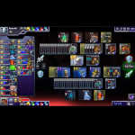
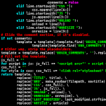
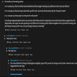
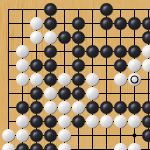
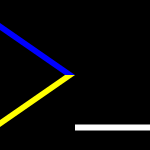

TITLE Yujiri's homepage
NAV Yujiri's homepage
TEMPLATE DEFAULT
ONLOAD resizeIndex()
ONRESIZE resizeIndex()
DESC I'm a programmer, writer, and philosopher of all things. I post about everything from game design and storytelling and conlangs to philosophy.

I'm a programmer, writer, and philosopher of all things. I post all kinds of stuff here.

<card-series>
<a class="card" href="prismata/">
	
<b>Prismata</b>

	
	
I used to play this game devoutly, and wrote a lot of beginner guides and stuff for it.

</a>
<a class="card" href="spem/">
	
<b>Spem</b>

	
	
The philosopher's conlang. Join me, and together we will rule our own minds.

</a>
<a class="card" href="software/">
	
<b>Software</b>

	
	
As my primary skill set, I naturally love to talk about software.

</a>
<a class="card" href="protagonism/">
	
<b>Protagonism</b>

	
	
Does it count as a religion if it's all a priori? 🤔

</a>
<a class="card" href="argument/">
	
<b>Argument</b>

	
	
Wherein I talk about conversational tricks and the role of psychology in arguments, and debunk random bad ideas.

</a>
<a class="card" href="music/">
	
<b>Music</b>

	
	
I'm a musician... sort of...

</a>
<a class="card" href="game_design/">
	
<b>Game Design</b>

	
	
Many people think that different people enjoy different things and so all judgements of games are nothing more than personal preferences, but I don't subscribe to that nihilism.

</a>
<a class="card" href="fiction/">
	
<b>Storytelling</b>

	
	
What <i>makes</i> a good story? I'm not quite sure myself, but I have plenty of ideas.

</a>
<a class="card" href="reviews/">
	
<b>Reviews</b>

	
	
I enjoy enumerating all the flaws in other people's stories and games, and occasionally gushing over good ones.

</a>
<a class="card" href="works/">
	
<b>My Works</b>

	
	
DDLC mods, poems

</a>
<a class="card" href="misc/">
	
<b>Miscellany</b>

	
	
Personal ramblings, stories, and secure contact info.

</a>
</card-series>
<recent-comments></recent-comments>

---

This site wouldn't be what it is without my dedicated contributor main_gi. He's been my de-facto editor for a long time, has helped me with CSS troubles, found two vulnerabilities in my comment feature, and even contributed valuable insight that got me to change some beliefs. His page is [here](https://igniam.xyz).

The above photos, where they're not mine, are from: [unknown pxhere user](https://pxhere.com/en/photo/986424), [Aaron Burden](https://negativespace.co/pen-notebook-notepad-paper-writing/), [sthenostudio](https://pixabay.com/illustrations/ratings-stars-quality-best-ranking-1482011/), and [César A. Mazillo Jr](https://unsplash.com/photos/tN9h1vuAp6Y).

I also have a presence on [Twitter](https://twitter.com/Yujiri3), [dev.to](https://dev.to/yujiri8), [Youtube](https://www.youtube.com/channel/UCmTi4rq5oOp2S9UER0BH3sQ) (on Youtube I currently only post [DDLC](reviews/ddlc)-related content), and [minds.com](https://minds.com/yujiri) (passively trying out, might start posting more in the future).

---

Recent update log

**August 8:**

* I found out about [the `
` and `
` elements](https://developer.mozilla.org/en-US/docs/Web/HTML/Element/details) and replaced `<expand-note>` with them!

* I found out the real solution to the monospace font size problem: `font-family: monospace, monospace`! Thanks to [normalize.css](https://github.com/necolas/normalize.css/blob/master/README.md#pre-code-kbd-samp)!

* I finally deleted the old crappy novels. I really did it. They're gone. I still reference The Pygon Hybrid in one of the storytelling philosophy aricles, but in a way that makes sense without the full text still being available.

**August 7:**
I've done a ton of editing old articles of storytelling and my Mass Effect review, and posted a new short: [A couple of garbage, under-criticized tropes](fiction/bad_tropes).

**August 4:**
Major work on notifications! You can now subscribe to articles, to get notified of new top-level comments, and to notifications on new articles.

**August 2:**
New [faction analysis: the Anarchist Left](argument/faction_ancom).

**July 27:**
New: [Dynamic typing is a sin](software/typing). Been working on that for a while.

And get this: I implemented comment autosaving! It saves every in-progress comment every 10 seconds.

**July 26:**
New: [Including library code in stack traces](software/library_stack_traces) and [Stop double-counting notifs](argument/grouping_notifs).

I have a memory of using something recently where my first suggestion in the stack trace article was used, but I can't remember what it was. It apparently wasn't Julia or Rust.

**July 25:**
Added [Why do all the dynamic languages catch name errors by default?](software/catch_name_errors). Used to be only [on dev.to](https://dev.to/yujiri8/why-do-all-the-dynamic-languages-catch-name-errors-by-default-5317), but I decided it was worthy of a spot here.

**July 24:**
Syntax highlighting support in code blocks in here! Both articles and comments. Courtesy of [Pygments](https://pygments.org). Enjoy.

**July 22:**
New: [Existing bigotry analysis: sexism](argument/bigotry).

**July 20:**
New: [Confessions of a keyboard warrior](misc/keyboard_warrior).

**July 19:**
I've redone my programming language reviews in a new style that's more "topic by topic" than "good things minus bad things". I don't use colored headings anymore because I think that was kind of limiting me to a one-sided tone within each section, and I use headings hierarchically now instead of using them to indicate magnitude (I think there are SEO benefits).

I also scrapped the article where I laid out a baseline for language reviews, since I don't think that makes much sense with the new style.

I also fixed a minor bug that would cause the "you'll receive a confirmation email about your account creation" message to appear when logging in while posting a comment. And the auth popup can now show specific error messages like "that name is claimed by a registered user" instead of always "invalid credentials".

I also unlinked the Uberpython article. It's a good article, but when redoing my Go review I decided I had a lot more points to make about the error handling, so I ended up going through it myself. And Uberpython is a Wordpress site, yuck.

Finally, I enabled the strikethrough plugin on the mistune markdown processor, so you can now use `~~text~~`.

**July 17:**
New articles:

* [Stop freaking out about self-promotion](argument/self_promotion)

* [What goes into a website?](software/website_guide)

**July 14:**
New rant: [Build systems are a scourge](software/build_systems).

**July 10:**
Added a link in the software index to [this Uberpython article](https://uberpython.wordpress.com/2012/09/23/why-im-not-leaving-python-for-go/) as my argument for exceptions over error returns.

**July 7:**
Added [Breadth-first versus depth-first autocompletion](software/tab_completion).

**July 5:**
Added [Dialog practice: best and worst lines in Star Wars](fiction/dialog_star_wars).

**July 3:**
Added [FreeBSD source code is bullshit](software/unix_src).

