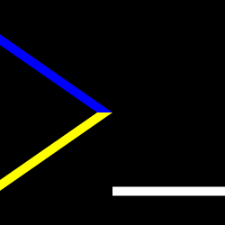
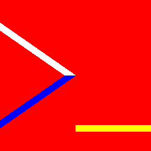

TITLE yujiri.xyz - The Logo Explained
NAV The Logo Explained
DESC My logo had a lot of thought put into it and I'm very satisfied.

Unlike most people's avatars, mine isn't an aesthetic I took a temporary infatuation with and will change next week. It's a cryptic representation of who I am - and that's why it changes at major turning points of my story, but *only* at such turning points. Here was the first version:

* The command-line symbol. Of course I'm into programming and [Unix](/software/why_unix), but the main reason I decided to use this symbol instead of some other computing-representing symbol, which came to my mind first, is the minimalism.

	A symbol with only three straight lines conveys a general attitude I have: discard everything you don't need. I think that's one of the best single proverbs for life in general. In software, [a simpler solution is better than a more complicated one, even if it cuts some corners](/software/features). It's good advice [in storytelling](/fiction/foreshadowing) and [in game design](/game_design/simplicity) too. In philosophy I place massive value on elegance and I'm always looking for ways to say that two ideas I believe in (like two virtues, or two prime emotions) are actually the same one. The more you remove without ruining the idea, the closer you must be getting to the real concept.

* The black background represented loneliness. When I used this logo, I had literally never met friends in meatspace, and it was my greatest pain in life. My family felt like an insulting excuse for company. I wrote the poem [Solitude](/works/poems/solitude) and the article on [snakes](snakes) to vent about it. I made black the background to show that it was the most pervasive feeling.

	But loneliness suited me in other ways. I was not the only [Protagonist](/protagonism/protagonism) by the time I decided to make myself a logo, but I felt rejected from every camp. I thought I was closest to [ancaps](/argument/faction_ancap) but they still hated me. Due to my very unusual life, I am often the only one who can't relate to an experience everyone else assumes is shared, like high school, in-person job interviews, office work (even though I was employed and earning money), leaving the house to hang out with friends...

* The white underline represents philosophy and wisdom, since light gives us information. I was 12 when I became a philosopher by [rejecting universally accepted but contradictory metaphysics](/protagonism/metaphysics).

	I'm sure someone thinks this is a hilarious case of [Dunning-Kreuger](https://yourbias.is/the-dunning-kruger-effect), but I actually consider myself very wise. I think I have a vastly above average understanding of human nature (which does actually encompass all of philosophy) even among people who self-identify as [philosophers](/argument/philosophy).

* The yellow line represents [Protagonism](/protagonism/). My favorite color has always been yellow, but by the first time I named my religion (it went through several names), the color had gained a religious symbolism to me. Yellow is the color of the sun, especially at dawn and dusk, and the image of a setting sun would be the Protagonist flag, if there were to be such a thing.

	It's because of a couple things. Firstly, anomaly is a factor of beauty. Part of the reason all of us find the sunset colors beautiful is precisely because they're only there for a tiny sliver of the day. If the sun were yellow all day and things turned more white for a few minutes around midday, we'd find that equally beautiful.

	Secondly, there's something very real to the relationship between Protagonism and the sunset. More generally, it's about vast things being beautiful. Associating beauty with vastness leads us toward thinking about vast things in real life; finding a purpose other than one's own happiness.

* The blue line represented my weakness. Water is fluid, harmless in most ways and easily appropriated. So I chose blue because I'm weak. I'm a terrible coward in real life; a terrible Protagonist. But I've come to terms with that, so I put it in my logo. I even put it on top of yellow to symbolize that I'm less than halfway an ideal Protagonist.

	This is part of why I want so badly to teach others, whether leading them to philosophic truth or just teaching programming or whatever. I'm not a hero and might never be. But I can be a mentor. So that's the role I'll try to fill as long as I'm on team good.

When I finally left my parents to go live with a fellow Protagonist marked the first turning point big enough to warrant a logo change. It became this:

The yellow and white mean the same thing as before, although I rearranged the colors because blue is here for a different reason: instead of sin, it represents my recently-acquired role as comforter. In my first year on Twitter, I met more suicidal anarchists than I can count, and keeping them alive became a core aspect of what I perceive my role to be. As of this writing I've definitely saved at least 1 and likely more. I'm very comfortable with the role, and I started to imagine myself as the party healer in a JRPG. (I would also cast buffs to represent my role as teacher, but I'm a healer too, and maybe first.)

I did not suddenly absolve myself from [the sin that blue used to stand for](/protagonism/vegan). I realized that red was the appropriate color because my greatest sin was spilling blood, and also that it was more appropriate as the background because it clearly outweighs all noble actions on my part.
