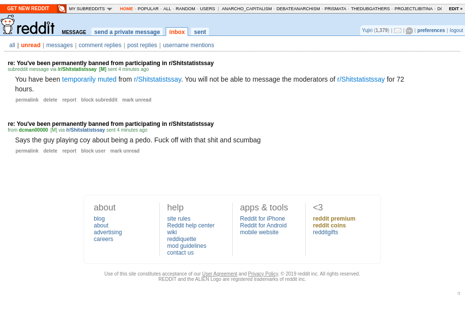
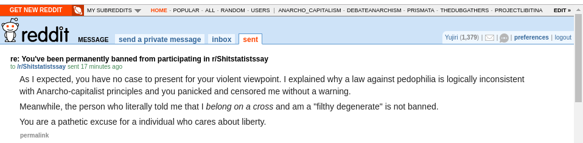

TITLE Age of consent ideology is self-contradicting
NAV "Age of consent"
TEMPLATE DEFAULT
DESC Ironically, enforcing an "age of consent" requires using violence to control people.

Most people of any political or 'religious' faction uphold some idea of an 'age of consent': an age before which a person is supposedly unable to consent to certain types of interaction and if they say they consent then they're wrong, and the people who believe in this will therefore claim that the act must be prevented even if both parties explicitly say they consent.

I've never heard any such person try to define consent, but beyond my doubt that they'd define it in a way that doesn't leave the age of consent an obviously made-up special case, the idea falls apart intrinsically.

Suppose a child below the arbitrary age of consent is in a relationship which they are judged to be incapable of consenting to, but they declare that they consent and it's clear there's no coercion from the other party. The philosophy of the age of consent here is "you can't consent, you're too young" but what does that entail doing about it? It entails preventing the action by force. In other words, forcing a decision on the child about their voluntary interactions with others. This concept, ostensibly invented to protect children from manipulation, can actually only work by asserting involuntary control over them. ([Damn it's almost like I've heard this before](anarchism).)

An argument's likely to be made to the effect of "a child can't validly consent to sex because they can't understand the implications of that act". If that's how consent works then I can also argue:

* You don't actually consent to buying product X, you're just too economically illiterate to know that it's not good for you. It should be illegal and the people who try to sell it to you should be punished to protect *you* even if you want to buy it.

* Recreational drug use should be illegal because it causes medical issues and most of the people who use them only do so out of ignorance of the risks, so they aren't really consenting;

* Unhealthy eating should be illegal because it causes medical issues and most of the people who do it only do so out of ignorance of the risks, so they aren't really consenting;

* Kids wasting their childhood on games (like I did mine) should be illegal because they'll deeply regret it for the rest of their life and they only do it because they don't realize that, so they're not really consenting to being allowed to play games;

* Learning Haskell as your [first programming language](/computing/why_program) should be illegal because it will result in you getting frustrated and quitting programming and the only way you'd try to learn Haskell first is if you didn't know about that, in which case you're not really consenting. It should be legally required to learn something like [Python](/computing/python) or [Go](/computing/go) first. This constitutes protecting programmers' consent!

It's obvious that that's not how consent works. Consent can only be invalid if it's obtained through deception or threats; the other cases where it's moral to violate someone for their own benefit (such as preventing a blind person from walking off a cliff) are because [other moral values can outweigh consent](virtues), not because that doesn't count as consent. (In the blind cliffwalker case, it's mostly because of the probability that it's not an intentional suicide.)

Even besides that, a "you don't know what you're getting into" argument is flawed when you try to apply it to sex because sex is something that derives its specialness (apart from procreation which we'll assume isn't relevant here) from people feeling that it is special.
If a person doesn't understand the meaning of sex, then to them it hasn't that meaning and it won't gain it retroactively.

Fun fact as of December 8: I was [instantly banned from r/ShitStatistsSay for a comment summarizing this argument, while a person who responded verbatim, "Fuck outta here with that pedo apologist shit. You belong on a cross you filthy degenerate", was not](https://www.reddit.com/r/Shitstatistssay/comments/e789gi/give_up_this_silly_idea_banning_things_is_wrong/fa5w60n/). Looking back at the sidebar, it *was* in the rules, but it's still an intensely validating experience to see that no argument could be provided against me; they just have to instantly ban anyone who points out the inconsistency in their beliefs.

Update: *oh* man, I'm laughing out loud right now. I just got a response from the moderators for the message I sent to shame them for their behavior:

He can't even get his grammar right :D It's especially hilarious after the message telling me I was banned invited me
to ask them about it:

For the record, this is the message I sent them:

I know [screenshots don't prove anything](/argument/screenshots), but I don't expect their truth to be disputed.
