TITLE Anarchist meme dump
NAV Anarchist meme dump
TEMPLATE DEFAULT
DESC A couple dozen anarchist memes I made some time ago. Enjoy :)

Some time ago I made a whole bunch of Anarchist memes, but I kind of forgot about them cause I never found a place that seemed like the right place to dump them all. Some of them are just variations onan idea with different templates. If you like, please share them somewhere!

Cops versus mercenaries, which is worse?
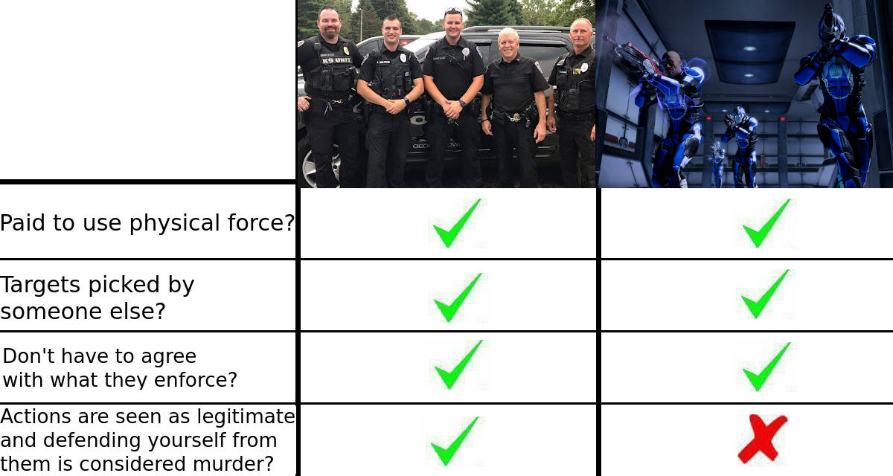

More relevant today than ever before:
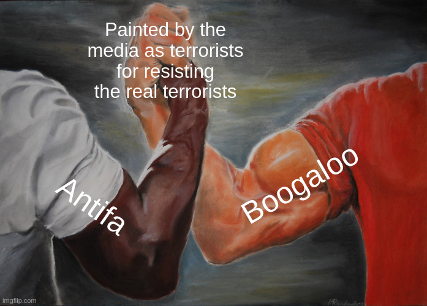

Everyone's favorite popular strawman of anarchism:
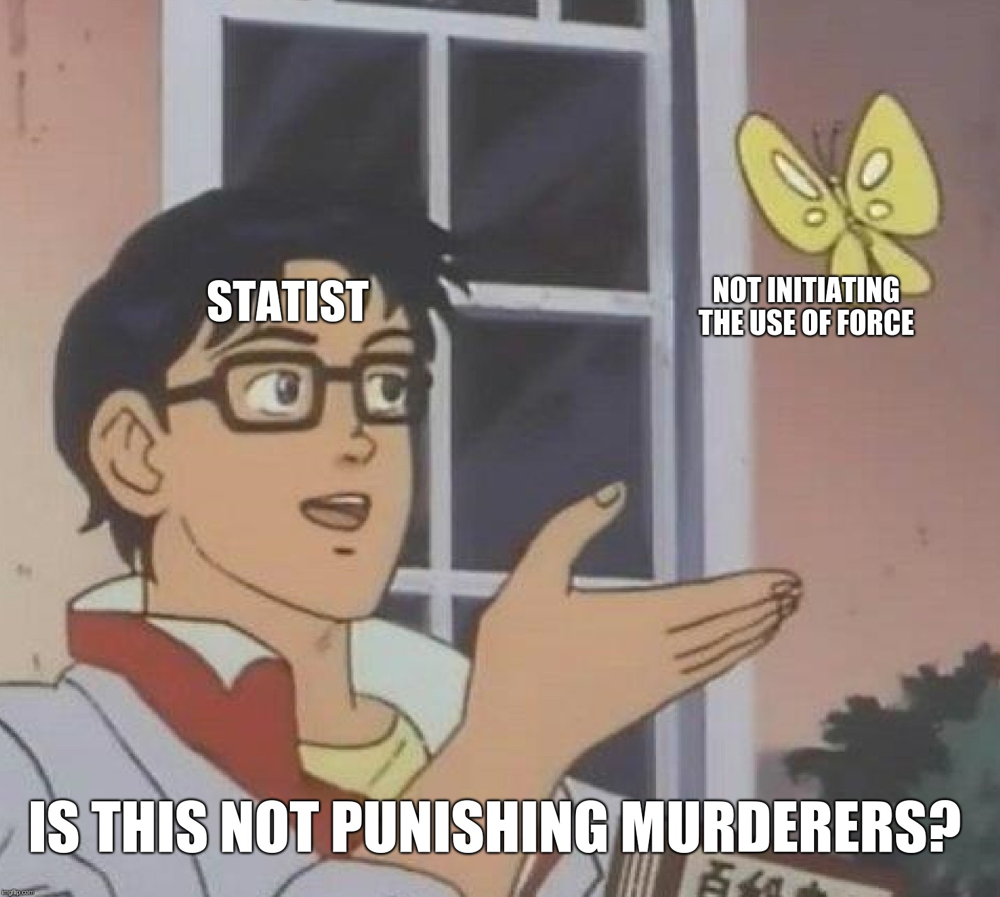

Believe it or not, I've actually heard statists accuse us of supporting slavery on several occasions.
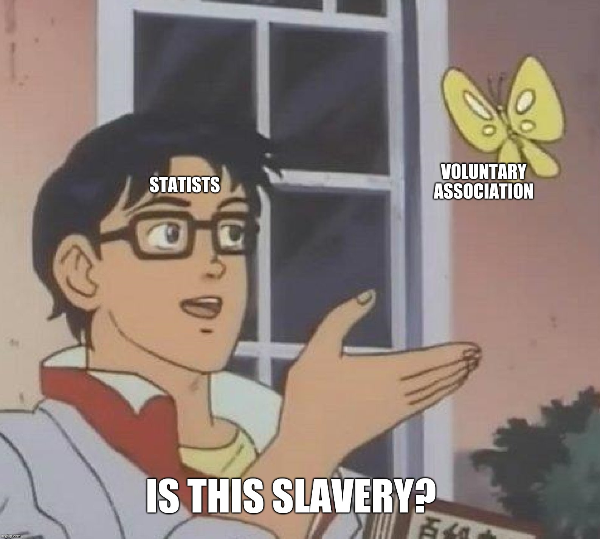

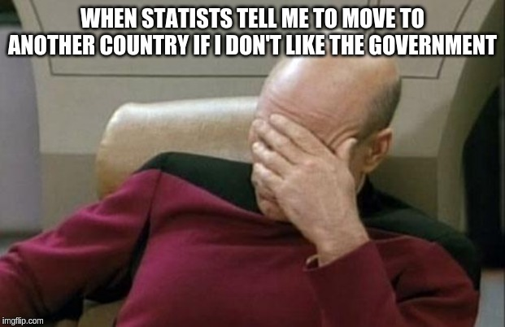

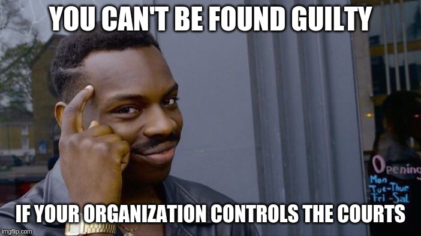

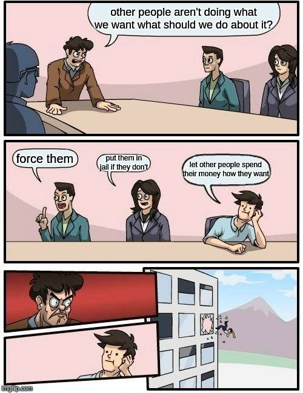

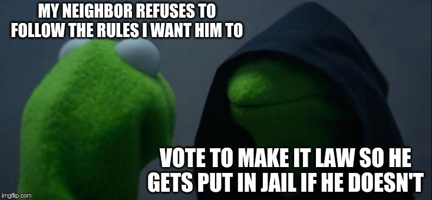

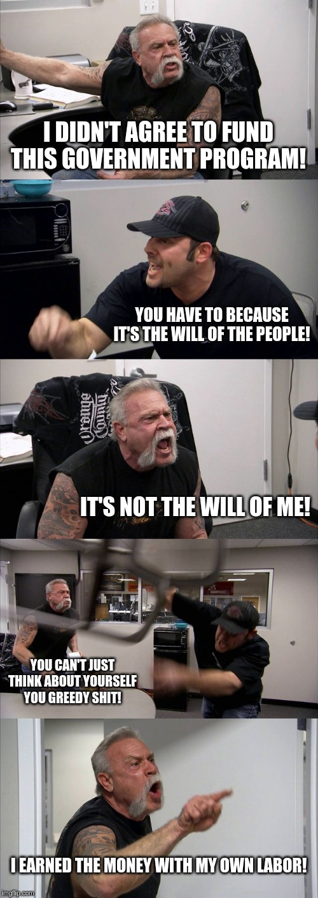

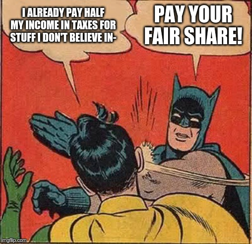

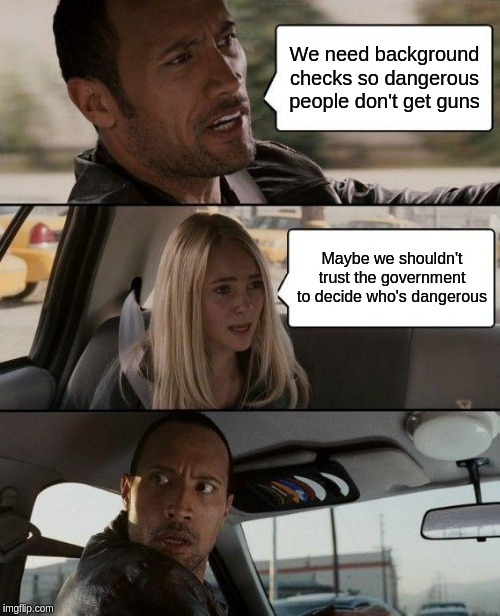

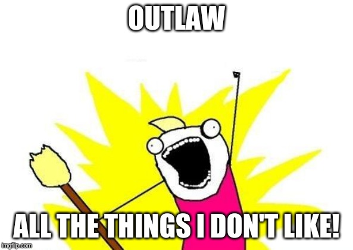

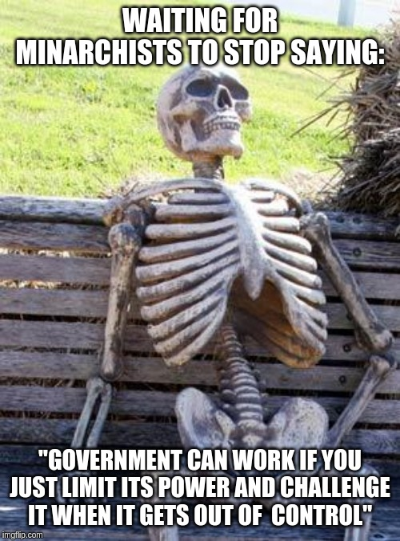

The progression to liberty.
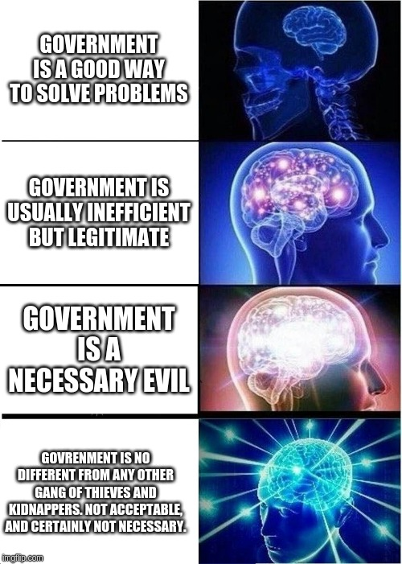

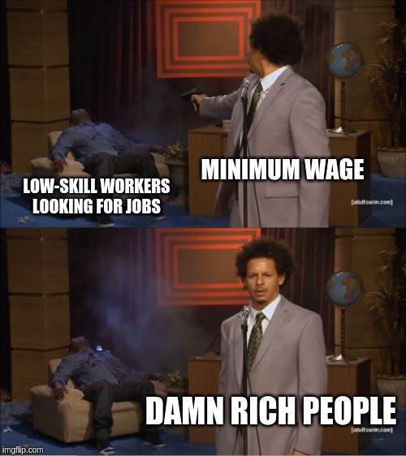

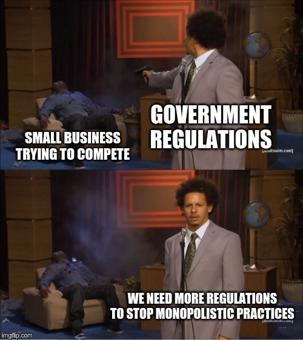

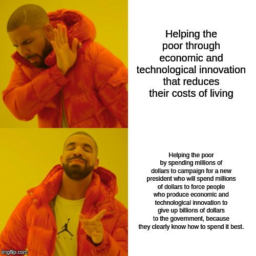

This one has a pretty interesting story. I was undercover at a state apologist training academy and one of their textbooks used this picture to illustrate a hierarchy of effective propaganda strategies.
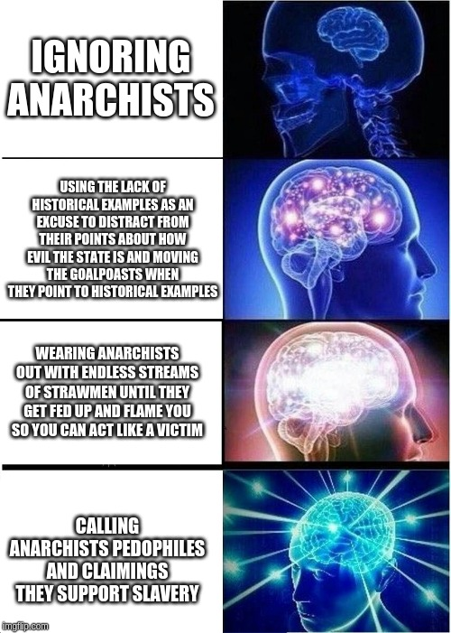

A more general version:
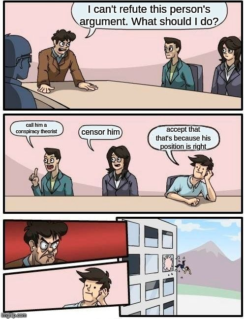

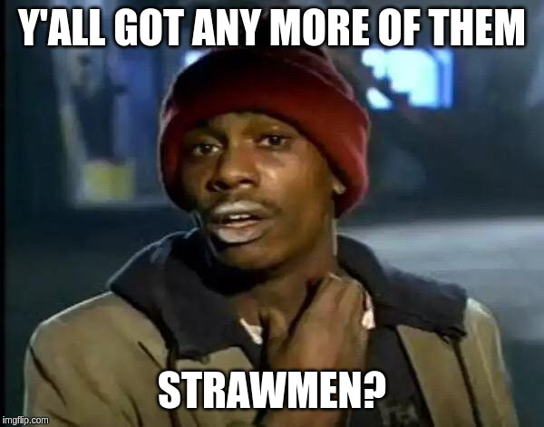
