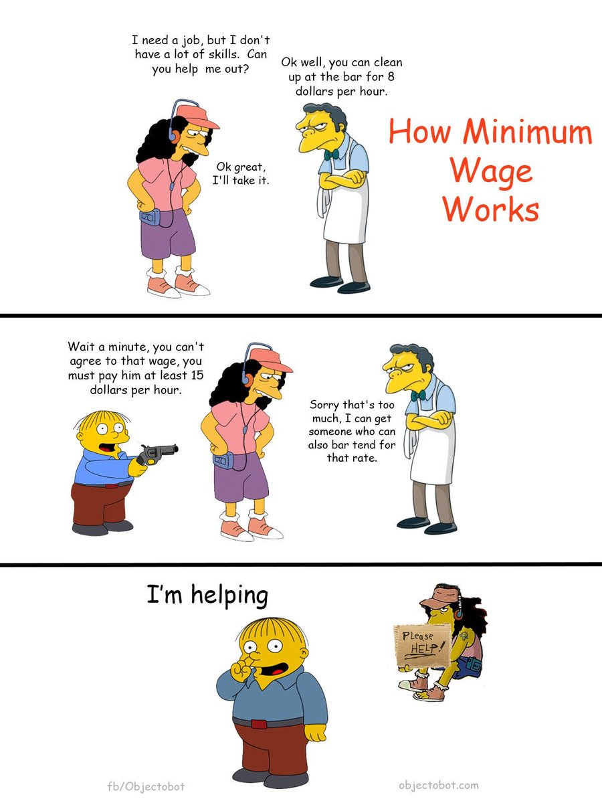

TITLE The free market in a nutshell
NAV The free market in a nutshell
TEMPLATE DEFAULT

Libertarians, and to a lesser extent [conservatives](/argument/left_right), are often heard rambling about how great the Free Market is and how it solves all problems and the government should get out of it. For the sake of people who might be perfectly earnest but unfortunately raised to believe many falsehoods about economics and haven't questioned them yet, I thought I'd make an article explaining what this talk is about. For this article, I'll assume there's no disagreement about [the legitimacy of property claims](/protagonism/property), since that's a separate issue and should be resolved first. This article's just about the pragmatic case for a free market.

The free market is based on a couple of simple observations, the first of which is: **the person best equipped to run your life is you.** Almost all government involvement ignores this truth, and as a result does not help the people it's supposed to.

One of the starkest examples is [the minimum wage](/argument/leftist_economics). A minimum wage takes choices away from poor people. Employment is voluntary - an employee is free to not work for a company that won't pay them as much as they want. Therefore, if someone's working a low-paying job in a free market society, it *must* be because they value that wage more than their time spent on anything else, otherwise they wouldn't be working there. So what does a minimum wage actually do?

Since employers retain the choice to not hire, it *stops low-skill workers from finding jobs* as often as it gets them higher pay. A minimum wage can only get you higher pay if it's still lower than the maximum amount profitable for the employer; if it's higher than that, it just stops you from finding a job. And of course, that maximum profitable amount varies way too much for any "minimum" wage to be set without destroying the lives of people who would've otherwise worked for less.

The lesson is that each person should be in control of their own choices, not some out-of-touch politician or voter.

In fact, there's [some](https://www.law.gmu.edu/assets/files/publications/working_papers/1004ExcludingUnfitWorkers.pdf) [evidence](http://www.princeton.edu/~tleonard/papers/retrospectives.pdf) that the minimum wage was *invented with this realization* for the purpose of preventing undesired groups of people from finding jobs.

[Occupational licensing](https://fakenous.net/?p=1654) and all sorts of regulations work the same way, although many of them are even more destructive. Consider <a rel="nofollow" href="https://www.fda.gov/food/guidance-regulation-food-and-dietary-supplements">food regulations</a>. Ostensibly, they make sure companies don't sell dangerous products - implying that without them, there would be nothing to stop companies from selling dangerous products. But is that accurate?

Without the FDA, we would be able to choose on an individual basis whether to buy food from a given company, knowing it hadn't been inspected. If we didn't want to buy food without an inspection, we could hire independent auditors to inspect the food company. They could choose to submit to the inspection or not, and if they didn't, we could consider that a failed inspection and refuse to buy from them; if they did then we could make a decision in light of the inspection's results. Of course, hiring independent inspectors would cost us extra money, but here's the thing: *so do the FDA regulations!*

The FDA (and every other regulatory agency) is a government body funded with our tax money, so the situation we currently have is as if there's that same independent inspector, but we don't have a choice in whether to hire them. The only difference is that we're *not allowed* to decide the cost is greater than the risk of uninspected products.

(If you argue that we *are* allowed to make the decision by voting, then seriously think that through - putting aside that the FDA isn't even elected, do you have a choice if you can only make it with the cooperation of millions of other people?)

So that's why we should abolish the FDA, and you don't need to [be an anarchist](anarchism) to agree. Regulations don't protect consumers, they take away consumers' choices.

## Incentives of a business

It's not just that regulations take consumers' choices away. Businesses have much better incentives than government agencies precisely because you get a choice with them. **If my income depends on your patronage, I'm incentivized to provide good service, because if I provide bad service, you won't patronize my business and I won't get money.** Your freedom holds me accountable. If I charge unreasonable prices, fail inspections by independent auditors, or misrepresent my products, I lose customers. My favorite way of putting it: **In a free market, businesses are not unregulated - they're regulated by their consumers.**

Many people who want government interference will latch onto the first thing they can think of that's currently controlled by the government, and claim a free market couldn't replace it. Of course, the reason those things aren't provided by the markets is because they're controlled by the government - not vice versa. **If there are no laws restricting the trade of X, and there's a popular demand for X, then people are willing to pay for it. And if people are willing to pay for X, then it's profitable to start a business that provides it.**

Some people will make a different criticism and argue that certain services are too essential to be provided by a market, since a market doesn't strictly guarantee that everyone gets something. They say "health care is a human right", by which they mean it must be provided by the government, "free" of charge (of course not really free because you just pay for it in your taxes). I find this argument very silly because no one applies it to food. Food is obviously more essential than health care, so if you trust a free market to provide food, why not health care?

This extends to everything government "provides". Law enforcement, arbitration, infrastructure, can all be provided in a free market. There are only benefits. See my article on [anarchism](anarchism) for more info.

## Corporatism - Fake markets

Some people will be averse to these arguments because many of the big corporations we see are, certainly, corrupt and conniving. They're understandably worried that a freer market would give the corporations even more power. But most of them didn't get so powerful by market competition; they [receive](https://www.marketwatch.com/story/why-governments-are-giving-billions-in-tax-breaks-to-apple-amazon-and-other-tech-giants-2016-10-13) [millions](https://www.siliconvalleywatcher.com/googles-billions-in-internet-subsidies/) [of dollars](https://qz.com/1145669/googles-true-origin-partly-lies-in-cia-and-nsa-research-grants-for-mass-surveillance/) [or more](https://en.wikipedia.org/wiki/History_of_Google) [every year](https://www.cnsnews.com/news/article/obama-google-facebook-would-not-exist-without-government-funding) [in tax funding](https://www.theguardian.com/cities/2018/jul/02/us-cities-and-states-give-big-tech-93bn-in-subsidies-in-five-years-tax-breaks). A lot of people actually don't know this (even I didn't know it until some [Anarcho-Capitalist](/argument/faction_ancap) youtubers mentioned it and I looked it up), but it's true. And this makes them not an example of the free market because they get money from you whether you want or use their services or not. So don't be fooled when people point to the failures of this economy or the misdeeds of corporations as evidence that a completely unregulated free market doesn't work - that's evidence that *government interference* doesn't work!

## Monopolies

The typical argument for how the market can "fail" is that if a company produces better products than someone else, they'll make more money and become more powerful and therefore be able to provide even better services, and drive all their competitors out of business. And once that happens, once there's only one firm providing something, they can charge as much as they want for it because you can't get it anywhere else. But there are many reasons this wouldn't be a problem in a free market.

1. No matter how much power a market firm gets, they stay dependent on their consumers to keep that power. I could have a billion dollars and a thousand employees, but if no one wants to buy from me, if I'm not still producing products that people want and selling them at a price people are willing to pay for them, I lose all my power.

2. If people were worried about a business forming a monopoly, they'd be less disposed to trade with that business, and so even *being close* to establishing a position you could abuse would itself impede my growth. You can actually see this happening a little bit with the tech giants right now; [some people are trying to boycott them](https://gizmodo.com/i-cut-the-big-five-tech-giants-from-my-life-it-was-hel-1831304194).

3. The bigger a business gets, the more customers it has, which means it costs them *more money* to lower their prices to win over more customers from their competitors. So that's another reason why the closer a firm got to monopoly, the harder it would be for them to get closer.

4. **Different things are worth different amounts to different people.** Maybe one company sells better and cheaper cars than another, and so they become more powerful, but the smaller competitor sells cars that appeal more to a niche customer base despite being "worse" overall. Maybe they sell cars with more passenger seats than most people need, but for the people that do need that, the bigger company's cars just won't do it no matter how much better and cheaper they are. It's not the product they need. As long as there are people like this, the big firm won't be able to drive the small competitor out of business.

	And what happens if the big company tries to produce both types of cars? Well, any car they produce that's sellable to the niche customer base *isn't* one of their other, "superior" models, so they can only produce the niche product by cutting back on producing their main product. They also probably have to buy some different machines to produce a different type of car. That will be a big cost.

	This is the same reason you don't see a single company dominating every market: just because they're great at providing one product doesn't mean they can provide a *different* product equally well. There's only a difference of degree between that car company trying to produce different kinds of cars and them suddenly trying to produce software or clothes, which no one would argue they could do so easily. Therefore, as long as there are *some* people who want a niche subtype of the product, it's extremely unlikely a monopoly provider could form on that product.

	In a nutshell: Economic value is relative! This is the whole reason *trade* is a thing! Most things aren't strictly better than other things. The same thing that's worth more to you is worth less to someone else, and if you trade, you can *both* come out having something you value more.

	Statists go wrong here with the [Fixed Pie Fallacy](https://www.youtube.com/watch?v=rixbHbaWBuk): they think things are all about *distributing* wealth properly. The unspoken - and false - assumption is that the only way one person can benefit is at the expense of another. That's just not true. Voluntary trade takes advantage of subjective value and makes *everyone* richer.

	Small children demonstrate this truth whenever they agree to play one another's games so each one gets what they want.
