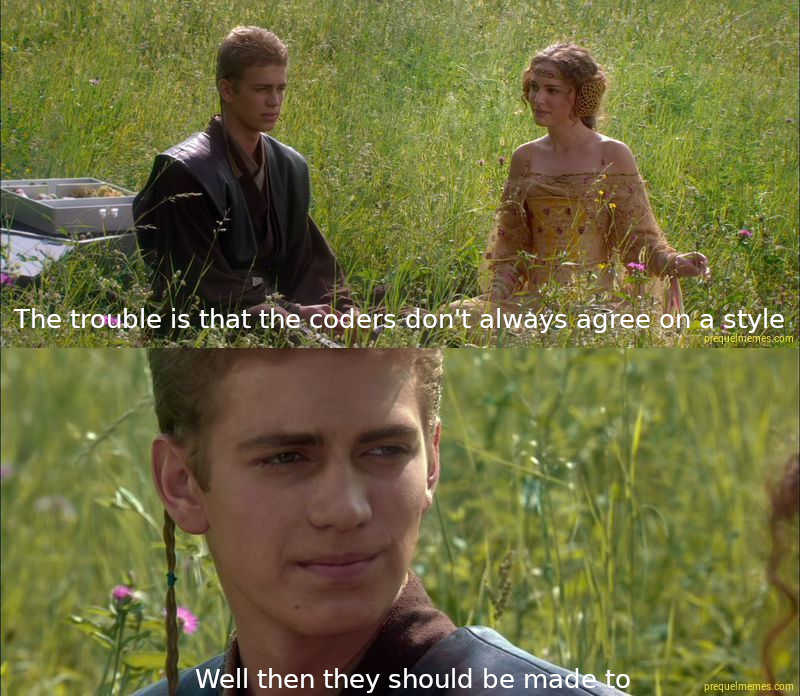

TITLE Go Review
NAV Review: Go
DESC Go is verbose and primitive, not what I'd call a good language, but it has strengths.

## How Go and I met

I'll start by telling the story of my experience with the language. I was thinking when I wrote [my opinion on Python](https://yujiri.xyz/software/python) that that would be a special thing just for then because Python has so much significance to me, but when I started to write this I figured it would be a good thing to do for all my language opinion articles.

It started after my application to work as an intern at [Lunarch Studios](http://lunarchstudios.com) developing [Prismata](https://yujiri.xyz/reviews/prismata) was rejected. That day was an awakening for me. Before that everyone I knew had always told me I was super smart and way above the curve in skills for the my age, even though I had spent most of the preceding few years playing games and working almost 0 hours a day. And until that day, I had believed it.

It wasn't just the rejection. It was the interview. I was a lot more disappointed in myself than the interviewer was with how long it took me to solve the clock problem. Even before I got the rejection notice, I realized that I had been fooled. I wasn't super smart. I was normal smart. And it was time to start catching up on skills.

I got back in contact with an old mentor of mine, and ended up his intern on a project written in Go, which he tasked me to learn for it. That was how it started.

At first, I hated Go. And I still stand by most of the complaints I had. But it wasn't until I went back to Python to write [Spacestation Defense](https://github.com/yujiri8/spacestation-defense) that I learned to appreciate the upsides of Go.

So here's what I think of the language now.

## Modes of use

Go compiles to native code with dependencies statically linked by default, which [I like](https://yujiri.xyz/software/go). It also supports dynamic linking and compiling to shared libraries that can be used by other languages. So as far as modes of use Go, I'm a big fan. As great as REPLs are, I'd rather miss one than have all the downsides of an interpreted language.

## Error handling

Go's error handling approach is easily the worst thing about it. There are five main problems with it: it's verbose, it's mistake-prone, errors carry almost no information, it breaks composability, and it doesn't play well with some other Go features.

Failure is signaled by returning error values instead of raising exceptions; for example `os.Open` has the signature `Open(name string) (*File, error)`. You're supposed to catch both the File pointer and the error and check the error manually before doing anything with the file. Here's the signature boilerplate:
```go
file, err := os.Open("file")
if err != nil {
	return err
}
```
You have to do this after *every single function call that might fail*. (It can be written with the function call and condition on the same line, but that's questionable style.) This boilerplate can easily take up 20% of a Go program.

And the errors themselves carry only the error message, not a stack trace or even a line number, so if an error gets returned through a stack of 5 functions, you have only slightly more to go on than if you just saw "error, figure it out yourself". [This package](https://github.com/pkg/errors) has been created by the community (no, it's not even stdlib) to make it easier to get context with your errors. It enables this:
```go
if err != nil {
	return errors.Wrap(err, "When doing X")
	// The returned error will be, "When doing X: ..."
}
```
Better, but we're still not getting a line number, so in a large codebase it can still be a hassle to track down where in the source that error message is from. And we have to write the error messages ourselves, which is tedious and prone to wrong error messages if you copy-paste. Boy, line numbers sure would be great.

My biggest criticism of Go is that its error-handling paradigm is "silently ignore errors unless told otherwise".

But perhaps even worse than all the tedium is what happens if you *forget* to handle an error: *silent runtime failures*, very similar in principle to [`{} - []` being `NaN`](https://yujiri.xyz/software/javascript), something most Gophers rightly ridicule. And the compiler doesn't even help you out. It doesn't print a warning if you leave an error unchecked (if you're catching from a function that returns multiple values then it'll make sure you have the right number of variables, but if you aren't catching the return value then the compiler is silent.)

I think the fact that 90% of the time what you do in these incessant error handling blocks is just return the error (or `log.Fatal` if it's top-level) is a pretty conclusive argument that propagating errors upward should be the default.

How does it break composability? Because if `func1` returns a `Thing` and an `error` and `func2` takes a `Thing`, you can't just do `func2(func1())` - you have to call `func1` and catch the error and check it manually before deciding whether to call `func2`. Similarly, helper functions are made expensive because you can't just have a function that concisely wraps another and doesn't have to know about its possibility of failure; you have to catch and return the error at *every step* to stop it from getting swallowed (unless the return types match exactly).

Finally, this error handling approach doesn't work well with `defer` (see below). Since you have to manually check the error to not silently ignore it, any error returned from a deferred call will get ignored. The only way to get around it is to do something like:
```go
defer func(){
	err = theThingIWantedToDefer()
	if err != nil {
		doSomething()
	}
}()
```
But that's so much clunkier than a normal `defer` call that we sometimes just leave errors here unchecked, if an error's unlikely to occur.

## Type system

Pretty primitive: no parameterized types (generics; although I [hear those might be added to Go 2](https://blog.golang.org/generics-next-step) which would significantly improve my opinion of the language), no product types (multiple return values is a special case) and no sum types (though you can [hack a vestige of them into existence](https://dev.to/yujiri8/implementing-maybe-in-go-124l)).

It does have [a fairly enlightened way of thinking about objects](https://yujiri.xyz/software/oop) though. It uses concise structs and struct embedding for inheritance, and methods are basically just functions that take the struct as an argument with a special syntax. Polymorphism is in the form of interfaces, which consist of only method signatures and allow any type that implements them to be used as the interface type. Reflection is powerful enough for good JSON support and [an ORM](https://gorm.io).

It also has first-class functions (as long as the full type signature matches), and enums.

Go can *sort of* get around the lack of generics with `interface{}` since an empty interface is implemented by every type; this is how `sort.Slice` in the standard library works (see below for why it can't take `[]interface{}`). But that sacrifices type-checking: since it only requires that its argument satisfy `interface{}`, Go can't even check at compile-time that it's getting a slice, so `sort.Slice` compiles successfully and then panics at run-time if you use it on something that isn't a slice.

A subtler issue is that type information is lost if you pass a value to a function that takes an interface, and the function does something to the value and returns it. It has to be returned as the interface type, since that's all the function knows about its argument - meaning the caller loses the information of which specific type it is, even if it's provably the same object. Unlike for example [Haskell](https://yujiri.xyz/software/haskell), Go's type checker is not smart enough for a specific type to "reappear" on the other side of a function that takes an interface. This isn't a big issue since you can basically get it back with a type assertion on the returned value, but it's inconvenient and the type assertion can't be type-checked.

### null

Null is not dealt with. Pointers, slices, maps, and channels can all be `nil`, with no compile-time checking and disastrous results for a mistake:

* Dereferencing a nil pointer panics. (Unlike C, at least the panic is guaranteed and comes with a stack trace.)

* A nil slice is actually interchangeable with an empty slice for most purposes, but not all; for example it comes out as null in JSON... and a struct field that's a slice type is nil if it's unset, not empty.

* A nil map can be read from and iterated as if it's an empty map, but setting a key panics.

* nil channels are infinitely worse than any of that: [a send to or receive from a nil channel blocks forever](https://dave.cheney.net/2014/03/19/channel-axioms) instead of crashing. Single instances of this mistake have costed me hours.

The non-pointer ones are easy mistakes to make because declaring those types, for example `var nums = []int`, makes it nil; you're supposed to use `make` to initialize them if you don't want nil.

There's also a gotcha with nil interfaces:
```go
package main

import "fmt"

type Cat struct {}

func (c Cat) Speak() {
	fmt.Println("Meow")
}

type Animal interface {
	Speak()
}

func main () {
	var c *Cat
	listen(c)
}

func listen(a Animal) {
    if a == nil {
        return
    }
    a.Speak()
}
```
This code will compile and then panic at runtime with `panic: value method main.Cat.Speak called using nil *Cat pointer`.

But how is that possible? I checked if it was nil!

The [Go FAQ](https://golang.org/doc/faq#nil_error) explains it, indicating that a lot of people have been confused by it. In brief, interfaces are never nil if they have a defined concrete type, even if they hold a nil pointer of that type.

### Interfaces sometimes don't match when they should

A struct with a method that returns a pointer to a struct that implements an interface isn't considered to implement an interface with a method that returns that interface; `[]struct{}` can't be passed for `[]interface{}`.

[The Go FAQ](https://golang.org/doc/faq#covariant_types) discusses this and explains that they implemented it this way because "If two methods return different types, they are not doing the same thing. Programmers who want covariant result types are often trying to express a type hierarchy through interfaces. In Go it's more natural to have a clean separation between interface and implementation."


### Numeric type are incompatible

You can't do math with an `int` and an `int32` or `int64` together, you can't even compare them. It doesn't seem like there's any way in which "is this int32 less than or greater than this int64" is an unmeaningful or unclear question. I've had to write simple math expressions of the form `intVar = round(otherIntVar * float32Var)` but needed three type casts: `intVar = int(math.Round(float64(otherIntVar) * float64(float32Var)))`, and ended up having to span multiple lines. I think a little type coercion is warranted here.

[The Go FAQ](https://golang.org/doc/faq#conversions) discusses this too. Their first point doesn't apply to `int32` with `int64`, the next two also wouldn't be problems for this case since an `int32` always fits in an `int64`, and the concerns about the compiler are probably valid. My point isn't that it's necessarily a mistake that they haven't implemented this feature, but that doing so would *only* burdens the compiler and not the usability of the language.

This makes the lack of generics worse, since a function that operates on `[]int` doesn't even work on `[]int32`.

## Syntax

Go uses braces to mark blocks, but thankfully doesn't require semicolons and parentheses around conditions. Channels and goroutines get intuitive dedicated syntax: `go func()` to launch a goroutine running `func`, `channel <- value` to send on a channel and `value <- channel` to receive. There's no interpolated string syntax, but that's not essential, and there are multiline strings with backquotes.

It's unfortunate that all the binary operators and syntax features like indexing and `range` are special magic for built-in types. There's no interface you can implement to use them on custom or library types. `time.Time` has methods `Add` and `Sub` instead of `+` and `-`, `After` and `Before` instead of `<` and `>`, etc.

### No inline branching

Go doesn't have a conditional operator or any other type of control-flow-as-expression. I've been in a lot of situations, like with CSV, where I have a long row of values:
```go
	field1,
	field2,
	field3,
```
And a lot of them need to be converted to string but can't be without a conditional operator because they're a type like [`null.Time`](https://github.com/guregu/null) which requires null checking. So I have to do the logic before writing the CSV row and use a temporary variable for the string representation. This makes my code not only bigger but *less clear*, since formatting the value is separated from the place I format it for.

The relevant FAQ section:

>There is no ternary testing operation in Go. You may use the following to achieve the same result:
>
>```go
>if expr {
>    n = trueVal
>} else {
>    n = falseVal
>}
>```
>
>The reason `?:` is absent from Go is that the language's designers had seen the operation used too often to create impenetrably complex expressions. The if-else form, although longer, is unquestionably clearer. A language needs only one conditional control flow construct. 

The if/else does make this single construct clearer (I guess), but if it takes up 5 times as much space, you can fit less code on the screen, which harms readability.

And if a language needs only one conditional control flow construct, then why does Go have `switch`?

### No default values in function args

I've frequently been bitten by the inability to have a function parameter with a default value. Without default values, everything that calls a function has to know what the default is. It's a form of unnecessary coupling, which damages both readability and maintainability.

The standard library suffers from it with functions like `strconv.FormatInt`, which needs a base parameter, and `strconv.FormatFloat`, which needs *four* parameters.

Not supporting default values also increases the need for comments, since it often means you just have to say what the parameter should be by default in the docstring.

### No way to capture only one return value of a function inline

A function that returns two values has to be called and caught on its own if you only want one value. You can't do `f1(f2()[0])` because you'll get `multiple-value f2() in single-value context` even if f1 takes one argument and it's the same type as f2's first return value.

Curiously, while Go does support composing functions that return multiple values with other functions that accept the same types, this only works as a special case, not with more arguments. For example,

```go
func main() {
	f1(f2())
}
func f2() (int, int, int) {
        return 4, 5, 6
}
func f1(a int, b int, c int) {
        fmt.Println(a, b, c)
}

```
works, but
```go
func main() {
        f1(f2(), 6)
}

func f2() (int, int) {
        return 4, 5
}
func f1(a int, b int, c int) {
        fmt.Println(a, b, c)
}
```

Fails with `not enough arguments in call to f1` and `multiple-value f2() in single-value context`. (And yes, I tried replacing the call with `f1(f2()..., 6)`; that gives `unexpected literal 6, expecting )`.) Why implement this as a confusing special case instead of letting it work the way Python does? Go has the `...` equivalent to Python's `*`. Why not let it work consistently?

### Variable declarations

Having these [makes little sense when the compiler also finds unused vars](https://yujiri.xyz/software/declarations), but oh well. And there are two syntaxes for it: `var val = 5` or `val := 5`. Most of the time they're interchangeable, but there are subtle differences:

* `:=` can't be used outside of a function; you have to use `var` for global variables. I'm not sure what the reason for this is, but it's what they decided.

* `var` requires that *all* variables on the left are new. This will fail to compile:
	```go
	var x = 5
	var x, y = getMeTwoInts()
	```
	But this works:
	```go
	var x = 5
	x, y := getMeTwoInts()
	```

* You can't use `:=` for initializing a nil pointer. `x *Thingy := nil` fails with `non-name x *Thingy on left side of :=`, `use of untyped nil`, and `undefined: x`.

So while I generally prefer the more concise `:=`, there are cases where you *have* to use `var`, and we'd certainly prefer to keep our style consistent... So basically it's an area rife for style disagreements where `go fmt` doesn't have an opinion.

## Array operations

Most array operations are extremely verbose.

* Append and concatenate are not terrible: `items = append(items, item)` and `items = append(items, others...)`. Annoying if `items` is a struct field or otherwise has a long time, since you have to write it twice.

* Delete an item from a slice: `items = append(items[:i], items[i+1:]...)` Yuck... I gotta really look at that to tell what's going on, especially since we're using the *append* function to *remove* items. This also doesn't give you the item removed; it gets worse if you want something equivalent to Python's `list.pop`.

* Insert an element into a slice at an arbitrary position? This is where it gets terrible. `items = append(items[:i], append([]T{item}, items[i:]...)...)` where T is the type of the items. It has to be this way because a single variadic parameter can't take both a singleton argument and a variadic argument.

* Want to try *reversing* a slice? Go's about to throw you for a loop.
	```go
	for i := len(items)/2 - 1; i >= 0; i-- {
		opp := len(items) - 1 - i
		items[i], items[opp] = items[opp], items[i]
	}
	```
	As an additional downside of this not being a built-in oneliner, every time you type this out there's a chance you'll make a mistake, and it'll probably be a logic bug that'll take at least a good five to ten minutes to track down if it's part of a big project.

* You want to even just test for membership in a slice? Time for another for loop.
	```go
	var found bool
	for i := range items {
		if items[i] == item {
			found = true
			break
		}
	}
	```
	Yes, that's literally what you have to do.

* Want to find out if two slices have all the same elements? `==` is an `invalid operation: slice can only be compared to nil`. Better use a for loop.

* map, filter, reduce? As if. Back to the for loop.

* Maximum or minimum of a sequence? Nope, not even that.

* Well, at least Go supports negative indices, right? Um... about that...

And I didn't reach these conclusions all on my own! [The github golang wiki confirms that these are really the simplest ways to do these things in Go](https://github.com/golang/go/wiki/SliceTricks) (insert and delete have alternate solutions but they're multi-line and arguably not any more readable). For a language that's supposedly so pragmatic, this is inexcusable.

And without generics, you can't even really implement these yourself like you could in say, OCaml (another language sorely lacking in them although not this bad). [This library](https://github.com/thoas/go-funk) implements them using reflection, but that of course sacrifices type checking as well as incurs a huge performance cost.

## Concurrency

One of Go's main marketing points is "concurrent by design", and it's true - it's definitely the best concurrency experience I've had. It uses green threads called goroutines which have a great syntax and can do parallel processing as easily as concurrent IO. Communication between them is done with channels, which are a flexible message queue system that support synchronous send and receive, asynchronous send and receive and selecting on multiple channels with the builtin `select` statement, and an option to be buffered so they can hold a few pending messages before sending blocks.

One of the things I like about channels is how their semantics correspond to Unix pipes. Receiving from a closed channel returns the zero value immediately, sending to a closed channel panics (SIGPIPE), and you can survive it with a `defer`/`recover` pattern, which is reminiscent of a signal handler.

Some of the other concurrency stuff is also amazing, like `sync.WaitGroup`.

My only notable gripe with channels is their behavior if `nil`. I've also heard people complain that there's no way to have an *infinitely* buffered channel that never blocks, and it sounds like a valid criticism to me but I've never run into it.

## Resource management

For handling resource cleanup, Go has `defer`, which queues a function call for execution when the current function returns. Deferred calls are run even if the function panics.

It's a very flexible solution; it can be used with any function call and doesn't require implementing an interface. I also like that `defer` doesn't indent the area the resource is used for. Python's equivalent does, and it often feels like a needless indent to me.

But a notable downside is that is that you can't have it execute *before* the current function exits. For example, if you open a file, defer closing it, do your stuff with it and then do the same with a second file, the first one stays open until you're done with the second. With a solution like Python's `with`, each resource is closed as soon as you're done with it.

## Tooling

Go is the first language I've seen with not only a standard style, but a built-in code formatter. I've always been a bit of a maverick when it comes to code style, but when I write Go I just run `go fmt` and it look just like everyone else's without any effort! I love having an autoformatter tool just put an end to most disagreements and decisions about style and let the language make everyone consistent.



But it's even better than that. [Goimports](https://godoc.org/golang.org/x/tools/cmd/goimports) is an improved version of `go fmt` that also can usually handle your imports for you, adding missing ones and removing unused ones and even automatically sorting them, and there are also some really good third-party vetting and linting tools, like [golangci-lint](https://github.com/golangci/golangci-lint).

There's no [build system hell](https://yujiri.xyz/software/build_systems). You do `go mod init` when setting up a project and then `go build` Just Works.

### Compiler red tape

My only criticism related to tooling. The compiler won't compile a program with an unused import or variable (although it does allow unused functions, function parameters, and global variables). It's great to have the compiler *warn* us about these things, but *preventing* us from compiling it is just absurd. All the time in debugging I comment something out and it results in an unused variable or import, and Go refuses to compile. Ugh... gotta go back into the source and comment out the declaration too.

The [Go FAQ](https://golang.org/doc/faq#unused_variables_and_imports) actually address this:

> First, if it's worth complaining about, it's worth fixing in the code. (And if it's not worth fixing, it's not worth mentioning.) Second, having the compiler generate warnings encourages the implementation to warn about weak cases that can make compilation noisy, masking real errors that should be fixed.

This reasoning is so obviously wrong it's hard to believe it's sincere. Yes, it *is* worth fixing, which is why I didn't `git add`! It's *not* worth delaying my test and forcing me to fix code that *will never be run outside of this test* so that it takes me longer to get the final commit ready and fixed. This justification is written as if debugging isn't a thing.

And their point about "encourages the implementation to warn about weak cases..."? Arguing that the language spec should treat unused code as fatal errors because treating it as non-fatal will lead to people writing Go compilers that will output so much unimportant noise that the unused code warnings will get ignored is such an insane stretch that you might as well say Go shouldn't allow programs to log to stderr unless they're crashing because that will lead to people writing programs that generate so much log volume that important stuff will get ignored.

Compilers are for verifying that code works and making it executable; *linters* are for things like this. In fact, `go vet` comes with Go and does this exact thing.

## Documentation

Go has the best documentation of any language I've seen, as well as the most sophisticated CLI tool for generating and viewing it. For example I can view the source of a symbol in a library using `go doc -src`, without having to go find the source myself; that's a feature I haven't seen in other languages' equivalents.

## Stdlib and ecosystem

Go has been around for less than half as long as Python, but its [standard library](https://golang.org/pkg/) and ecosystem seem to be almost if not equally vast. You pretty much can't find anything there isn't a Go library for. The community is also pretty good at documentation their packages.

---

<br>

My final opinion of Go is fairly negative. The error-handling is pretty much a deal breaker for me; I'd even rather use dynamic typing. But it has several advantages over each of the other languages I know. I could see myself choosing it someday for something concurrency-heavy.
