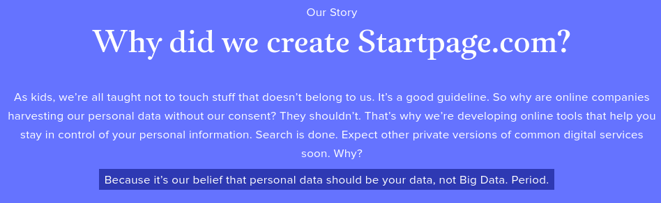

TITLE Online privacy is overrated
NAV Online privacy is overrated
TEMPLATE DEFAULT
DESC There's no right to online privacy, and tailored search results are just better.

Online privacy is overrated. The widespread concern about corporations collecting data on us is almost entirely unwarranted. And I used to be passionate about it too, but then I started to realize how unreasonable it was.

Privacy advocates will talk about how the eevul corporations are collecting your data without your "consent", and compare it to "touching stuff that doesn't belong to them":

Honestly, this is ridiculous. Consent is a word that suggests someone *doing* something to you, something that affects you. It's not "touching something that doesn't belong to them" because there's nothing being touched that's our property. I don't own the *information* of what websites I've been visiting and stuff. [I don't have a right to someone else not knowing things](/protagonism/power).

Personalization is a benefit. Who would honestly prefer to see random ads instead of ads that at least have something to do with something they're interested in? Who cares if it's 'creepy'? We should care that it's *clearly beneficial*.

Advertising is a glorious business. It's a business where us end users can benefit without even paying anything. Essential online services like search are able to be free because of advertising. (Actually, Google *isn't* free but rather we're [forced](/protagonism/enforcement) to pay for it <a rel="nofollow" href="http://www.precursorblog.com/content/how-much-should-google-be-subsidized">because</a> <a rel="nofollow" href="https://www.marketwatch.com/story/why-governments-are-giving-billions-in-tax-breaks-to-apple-amazon-and-other-tech-giants-2016-10-13">it's</a> <a rel="nofollow" href="https://www.siliconvalleywatcher.com/googles-billions-in-internet-subsidies/">heavily</a> <a rel="nofollow" href="https://qz.com/1145669/googles-true-origin-partly-lies-in-cia-and-nsa-research-grants-for-mass-surveillance/">tax</a>-<a rel="nofollow" href="https://www.theguardian.com/cities/2018/jul/02/us-cities-and-states-give-big-tech-93bn-in-subsidies-in-five-years-tax-breaks">subsidized</a>, but that's a sunk cost with regard to whether we use it or other search engines.) It's even more mutually beneficial than other businesses. Advertising businesses shouldn't be seen as scary villains, quite the opposite.

Google showing you results it thinks you want is *good* and I hope Google does more of that.

Besides, you can opt out of Google's search result personalization! Or use [Tor](https://torproject.org). But due to my changing perspective, I recently switched my default search engine from DuckDuckGo back to Google and enabled the data collection.

None of the other search engines are as good as Google anyway. Even with personalization turned off, I regularly got more relevant results with Google than with Startpage or DuckDuckGo, both of which I used for a long time. Let's stop sacrificing quality of service for no reason.
