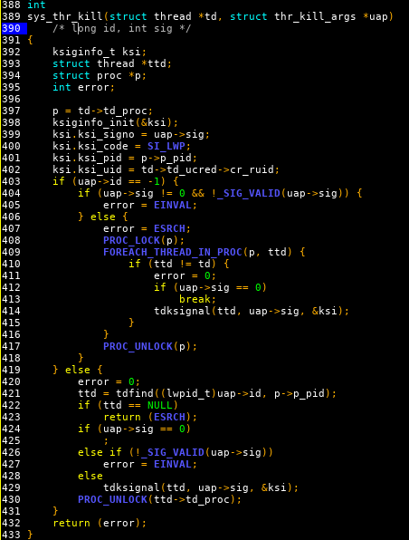
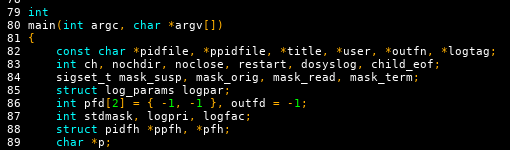

TITLE FreeBSD source code is bullshit.
NAV FreeBSD source code is bullshit
TEMPLATE DEFAULT
DESC ppfh is not an excusable variable name under any circumstances.

I've read a good bit of the FreeBSD source code for both the kernel and the base tools. There is one main thing about it that is bungled worse and more consistently than anything else in the software universe: nomenclature.

Here is some kernel threading code.

Yes. They literally named "kernel signal info" `ksi`.

And what the fuck is `uap`? That one, I don't even know what it stands for after seeing its type! Unclear argument pointer?

And our two `struct thread` pointers are named `td` and `ttd`? Why don't they abbreviate *thread* as `thr`? The function name and filename do. And `uap` should be called `args`.

There is only one sane variable name in this function.

Here's the beginning of the daemon(8) main function:

`ppfh` is not an excusable variable name under any circumstances.

I didn't cherry pick these. You can open almost any random file from `/usr/src` and see a mess like this.

How about some FreeBSD syscalls?

* `dup`
* `dup2`
* `wait`
* `wait3`
* `wait4`
* `wait6`

And some library functions?

* `dup3` (no, this one is not a syscall like the others)
* `strtol` - string to long
* `strtoul` - string to unsigned long
* `wcstoul` - wide char string to unsigned long... but why is the `r` missing? (I actually didn't notice the `t` was missing too until I was proofreading this article.)
* `rint` - 'round to int' (this is for real, and it takes and returns a `double`)
* `a64l` - convert base64 ASCII to a long
* `cfmakeraw` - set the `termios` structure (terminal settings you get from `tcgetattr`) to raw mode. I guess `cf` stands for configure (`cfg` please?), `tc` I have no idea.

Every aspect of the whole system is like this. For shell command names it's good because you have to type them all the time and rarely read them; for source code names it's terrible because you type them once or rarely and read them all the time.

It's like the FreeBSD devs haven't learned [the value of readability](https://yujiri.xyz/software/readability) when it comes to names, even though they've clearly learned it in other ways. No mortal can maintain code like this. No wonder there are [thousands of open bug reports](https://bugs.freebsd.org/bugzilla/page.cgi?id=showreport.html&type=total_open_bugs_over_time). No wonder there are so few developers. No wonder Unix is fringe.

I'm not trying to malign the contributions these hackers have made to the world. I benefit immeasurably from their work and they are obviously better qualified for the job than I am. But golly, I don't do *that* when I code.
